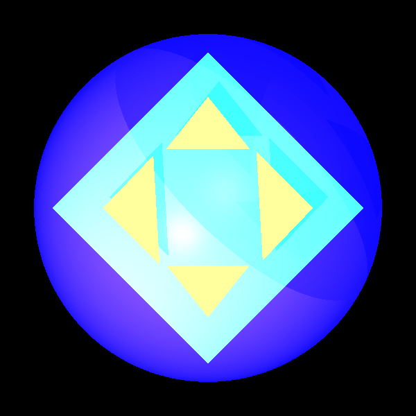
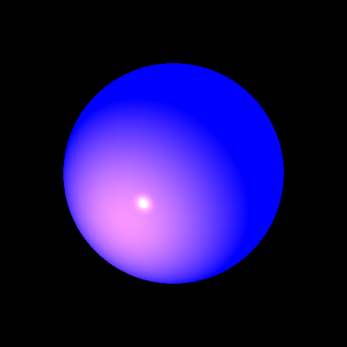
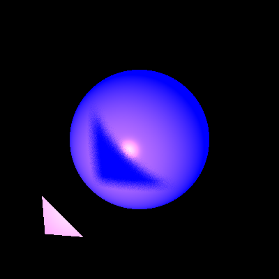
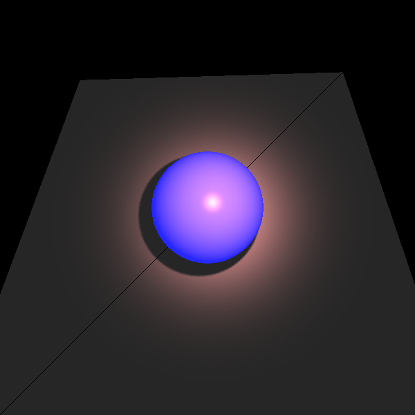
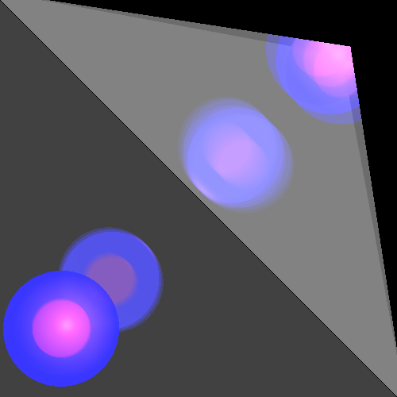

# Mini Project java 2021

 this program gives the possibilitie to build an image based on the following parameters:
 - camera
 - lights (ambiant,spot,point)
 - different sorts of geometic shapes 
 - - these  geometric shapes can have the color and even the material of your choice (based on transparency reflectance ... parameters that you set).
 
 we have taken care of the shape and the reflectance in a realistic way which means we have made it smooth as it is in real life
 ## examples of pictures 
 
 
 
 
 
 
 
 
 
 ## algorithm improvement
since after these improvement the execution time was pretty long we have made our program running on 3 threads and we have improved our algorithm (based on box)
pictures before and after algorithme improvement

